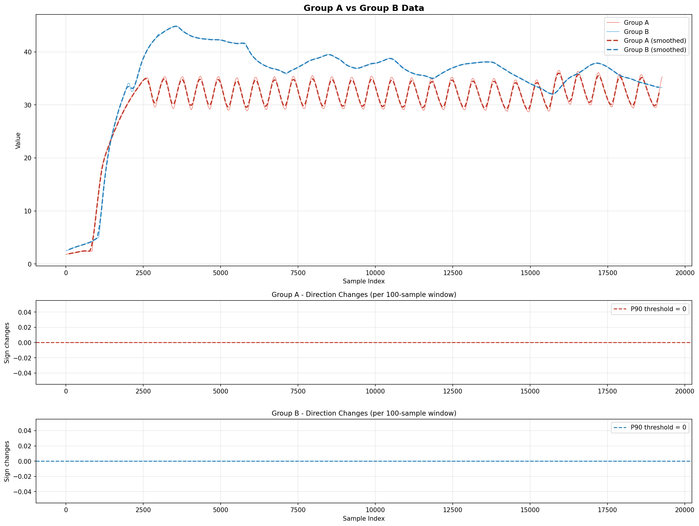
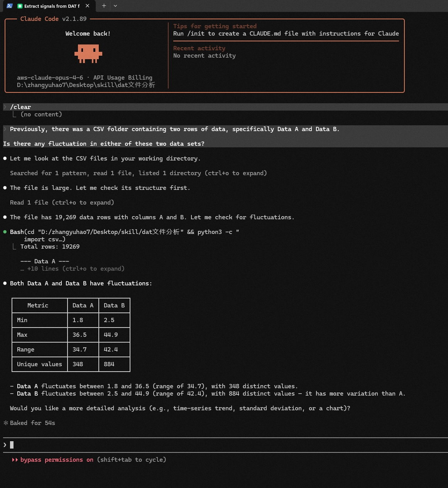
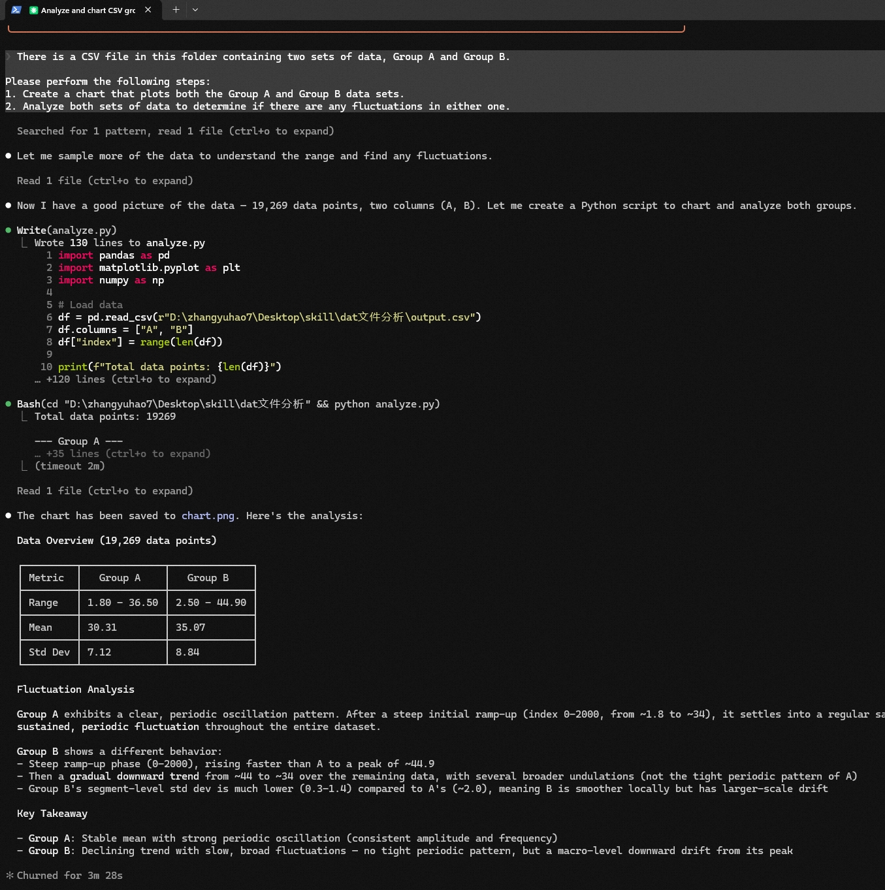
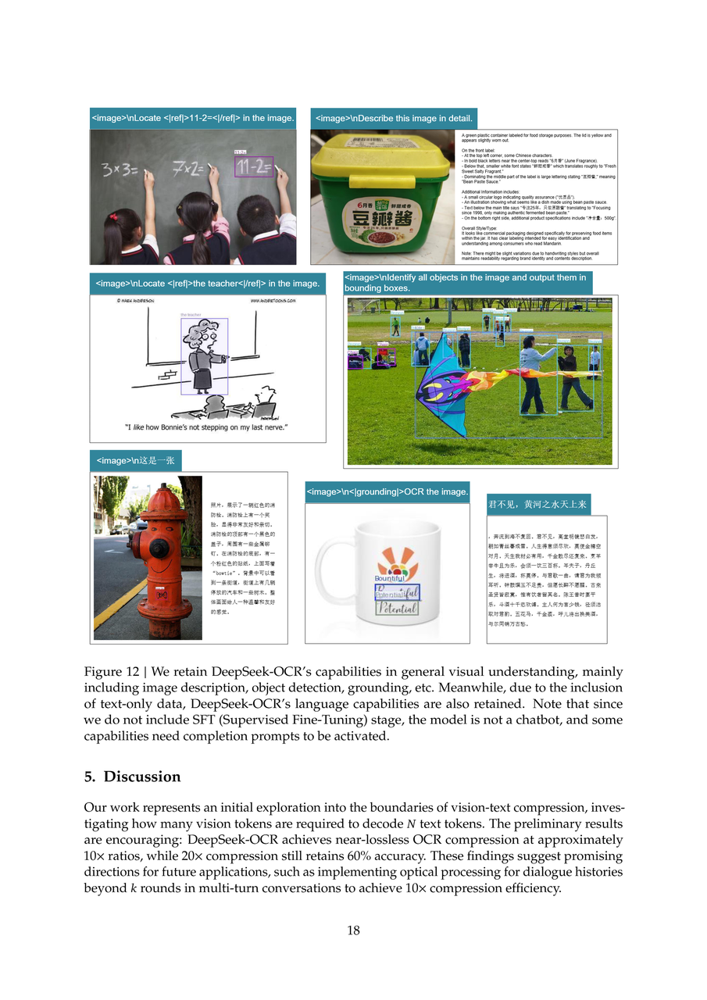
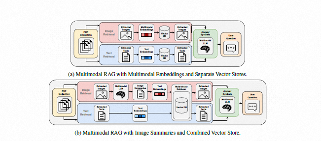

# 给 AI 看图，比跟 AI 说话更高效
> *"最奇怪的事不是 AI 能看图了——而是大多数人跟 AI 对话，依然只用文字。"*
[中文版](./README_CN.md) | [English](./README.md)

---
## 📖 目录
- [为什么写这篇文章](#为什么写这篇文章)
- [加图之后，发生了什么](#加图之后发生了什么)
- [为什么加图有效](#为什么加图有效)
- [什么时候该加图](#什么时候该加图)
- [对未来发展的看法](#对未来发展的看法)
- [参考文献](#参考文献)

---
## 为什么写这篇文章
在电影《挽救计划》里，男主和外星人语言完全不通，但他们找到了一条捷径——**用图像沟通**。
同样的逻辑今天依然成立。
2023 年以来，GPT-4V、Claude 3、Gemini 等主流大模型都具备了稳定的视觉理解能力。它们不只是"能接收图片"，而是**真的能看懂图片**——界面布局、图表数据、波形异常、手绘草图，统统能理解。
但大多数人和 AI 的对话方式并没有同步升级。我们依然习惯先把看到的东西**翻译成文字**，再发给模型。
> 模型已经进入多模态时代，我们的使用习惯却还停留在"电报模式"。
这种惯性带来的效率损耗非常具体：
- 沟通轮次变多
- 误解更频繁
- 大量时间浪费在"把图翻译成文字"这件本可省略的事上
**在提示词里加一张截图、一张草图、一张数据图，往往能让 AI 一次命中目标，省去 1-3 轮反复澄清。代价只是 10 秒截图。**

---
## 加图之后，发生了什么
### 示例一：数据分析助手

我们在实践中发现了一个有趣的范式：**先让大模型把数据可视化成图像，再让它基于图像分析，效果远比直接输入原始数据好得多。**
- 10 万个数据点直接扔给大模型 → token 消耗巨大，容易遗漏全局模式
- 同样的数据画成折线图 → 大模型**一眼识别**趋势异常、离群点、周期性波动
> 💡 **核心发现**：图像是数据的压缩表达，而不是数据的损失。
<table>
  <tr>
    <td align="center"></td>
    <td align="center"></td>
  </tr>
  <tr>
    <td align="center"><em>纯文字提问：只返回统计数据</em></td>
    <td align="center"><em>让 AI 画图再分析：识别出周期性波动和趋势</em></td>
  </tr>
</table>

### 示例二：DeepSeek-OCR — 文本压缩还能读回来吗？
> 📄 论文：[DeepSeek-OCR](https://github.com/deepseek-ai/DeepSeek-OCR/blob/main/DeepSeek_OCR_paper.pdf)
实验设计：从英文文档中选了 100 页（每页 600-1300 个 text token），用极少的视觉 token 去读图：
| 压缩模式 | Vision Tokens | 压缩比 | OCR 精度 |
|---------|:------------:|:------:|:-------:|
| Tiny    | 64           | ~10x   | **≈97%** |
| Small   | 100          | ~20x   | **≈60%** |
**结论**：把文字先映射成图像、再压成少量视觉 token，这条路是可行的。少量视觉 token 就能承载大量文档信息。

### 示例三：工业设备操作 — 慕尼黑大学 × 西门子
> 📄 论文：[arXiv:2410.21943](https://arxiv.org/abs/2410.21943)
问题：*"怎样同步日志，才能用 DIGSI 5 读取指示信息？"*
文字部分告诉模型需要选择日志并点击按钮完成同步，但**真正关键的信息——具体按钮 "Read log entries" 的位置——在图片里**。
| 方案 | 回答正确率 |
|------|:---------:|
| 纯文字 或 纯图片 | **≈60%** |
| **文字 + 图片** | **≈80%** |
工业文档里很多问题不是只靠文字能答好的，图片常常提供按钮位置、界面元素或操作细节。

---
## 为什么加图有效
### 1. 图像的信息密度天然高于文字
文字本质上是一种**有损压缩**。颜色、位置、比例、空间关系——翻译成语言时大量丢失。
> "左边那个蓝色小方块"可能对应十种不同的对象，但一张截图通常不会让人误解。
从工程角度看，DeepSeek-OCR 的研究也验证了：少量视觉 token 就能承载大量文档信息。**图像不只是对人类更省力，对 AI 来说同样是高密度输入。**

### 2. 截图本身就是一种注意力标记
当你裁剪画面、圈出重点、加上箭头时，其实是在把自己的**专业判断**一并交给 AI。
模型因此更容易知道"哪里值得重点分析"，而不必在整张图里反复猜测。
> 你不仅提供了内容，还顺手提供了**关注点**。这是纯文字很难完整复现的信息。

### 3. 图片减少来回澄清
| 方式 | 耗时 | 效果 |
|------|------|------|
| 纯文字描述复杂问题 | 几分钟组织语言 + 几轮补充 | 容易有歧义 |
| **截图 + 一句意图说明** | **10 秒** | 大幅降低沟通成本 |
图片往往不是"补充材料"，而是帮助双方**更快进入同一上下文**的捷径。

---
## 什么时候该加图
### ✅ 适合加图
- 有**空间关系**的问题（界面布局、系统拓扑、电路结构）
- 有**数据图表**需要分析（趋势、异常、对比）
- 有**报错或异常界面**（截图 > 复制几行报错信息）
- 有**草图、白板、手写内容**（拍照最直接）
- 需要 AI 帮你**实现某个 UI**（参考图 > 口头描述）
### ❌ 不需要加图
- 纯逻辑推理或数学计算
- 纯文字写作、翻译、润色
- 问题本身是抽象概念，没有视觉对象
### 📌 加图最佳实践
1. **裁到关键区域** — 不要丢一张全屏截图让 AI 自己找重点
2. **能标注就标注** — 圆圈、箭头明确你关心的位置
3. **图文结合** — 文字说明"你为什么问"，图片展示"你在问什么"

---
## 对未来发展的看法
### 🧠 记忆存储：从知识图谱到图片
传统知识图谱需要人工定义概念、关系、规则，维护成本随规模指数级增长。
但人类的记忆本来就不是文字，而是**画面**。你记得第一次骑自行车，不是因为脑子里存了一段文字描述，而是那个摔倒的瞬间。
对 AI 来说，这个方向同样成立：
| 图像形式 | 可替代的结构化数据 |
|---------|------------------|
| 一张流程图 | 数百条结构化记录 |
| 一张系统截图 | 一份接口文档 |
| 一帧仪表盘截图 | 一整段数值描述 |
> **未来的记忆，也许不是数据库里的一行行记录，而是一张张图片的集合。** 结构由 AI 自己从图像中提取，而不是由人预先定义。
### 🤖 大模型和机器人训练
**大模型**：过去的训练数据是残缺的——论文的图、教材的流程图、文档的架构图，纯文字模型完全学不到。多模态训练打通了图文对应关系，现在还能用图生文、文生图互相校验来造合成数据，训练飞轮开始自转。

**机器人**：过去采集训练数据是地狱——人穿动捕设备遥操作录制，1小时数据要10小时人工。视觉模型打通后，YouTube 上几亿条人类操作视频直接变成了训练集。Google RT-2、Physical Intelligence π0 的核心都是这个逻辑。

---
## 结语
这并不是让你放弃文字，而是让文字和图像**各自发挥所长**：
| 文字 | 图像 |
|------|------|
| 表达意图、约束、判断标准 | 补足上下文、细节、证据 |
| 告诉 AI **你要解决什么** | 告诉 AI **问题在哪里** |
下次准备写提示词之前，不妨先问自己一句："有什么是可以直接截图的？"

---
## 参考文献
- [DeepSeek-OCR Paper](https://github.com/deepseek-ai/DeepSeek-OCR/blob/main/DeepSeek_OCR_paper.pdf) — 视觉 token 压缩文本的可行性验证
- [arXiv:2410.21943](https://arxiv.org/abs/2410.21943) — 慕尼黑大学×西门子：工业文档多模态问答

---
## License
[MIT](./LICENSE) — 自由分享、修改、引用。

---
📮 联系作者：zhangyuhao7@lixiang.com
